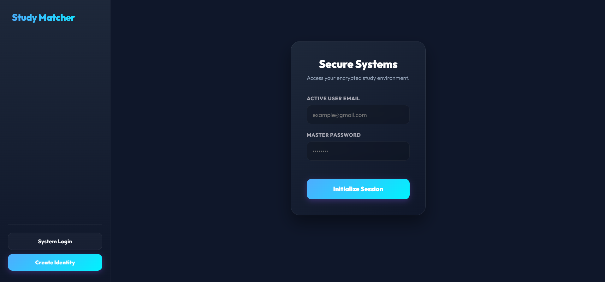
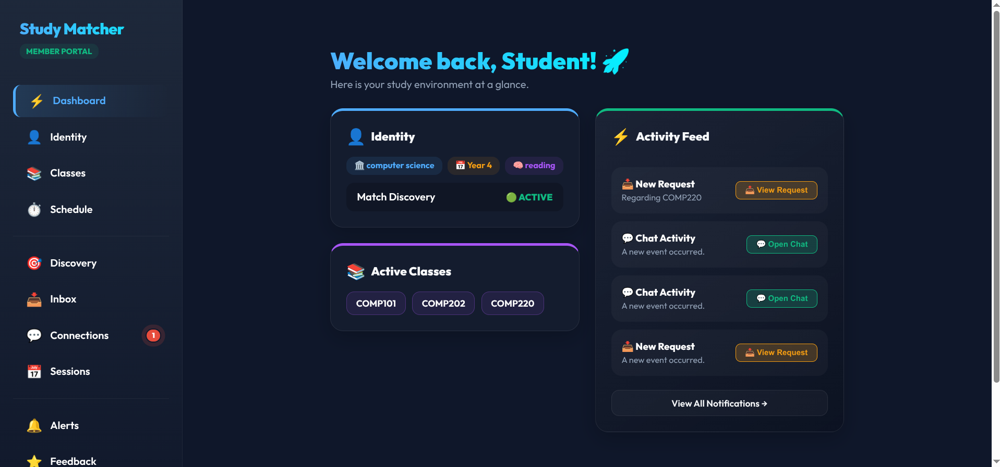
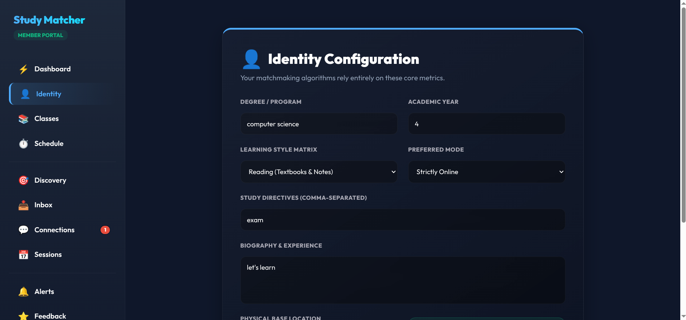
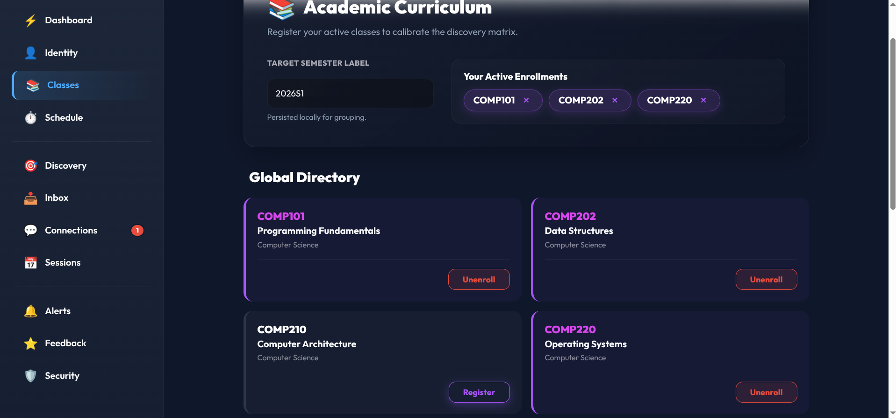
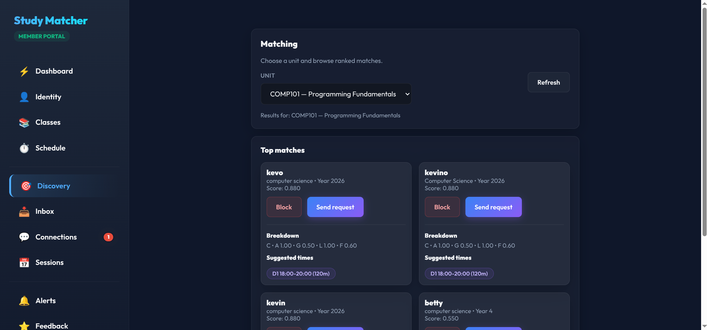
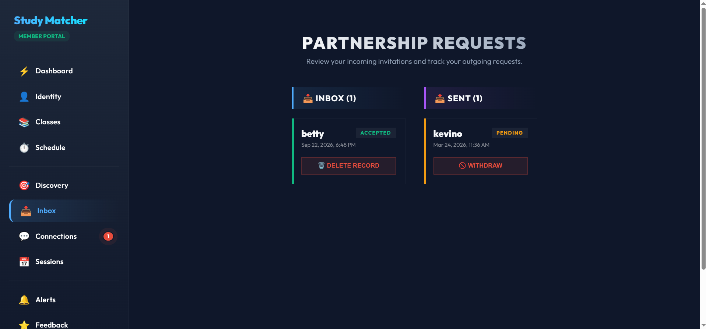
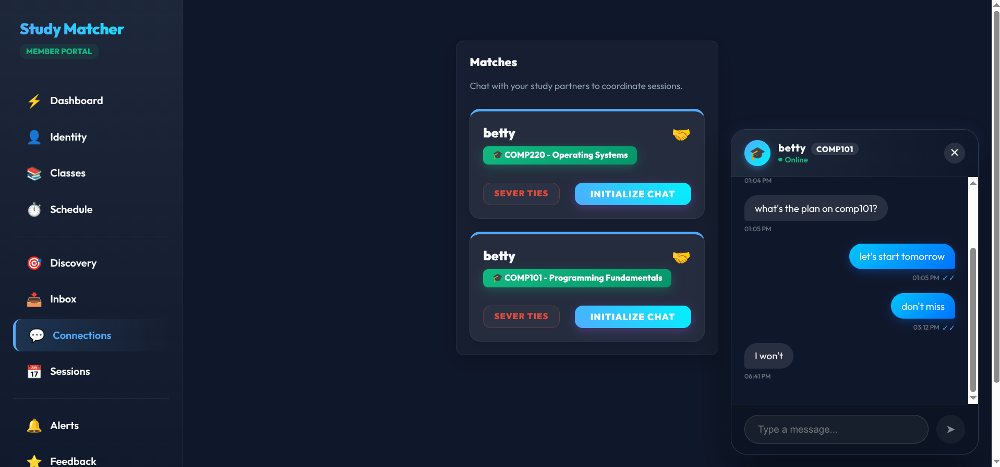
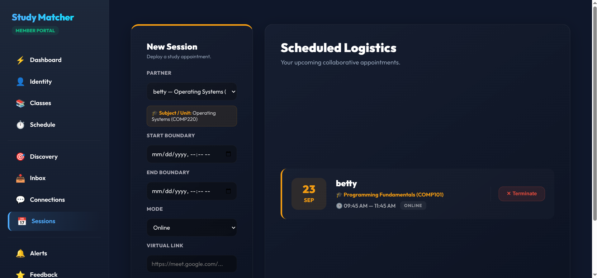
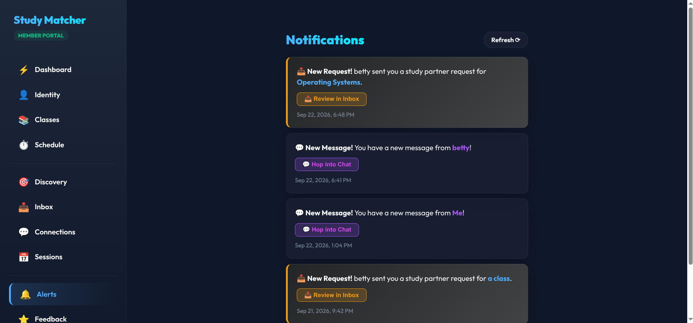

# Smart Study Matcher

Smart Study Matcher is a web-based study partner matching system designed to help university students find suitable study partners based on shared academic units, availability, study goals, learning styles, and feedback.

The system provides a structured alternative to informal methods of finding study partners by combining multiple compatibility factors and ranking potential matches according to a weighted matching score.

## Project Overview

University students often need to collaborate with other students for activities such as examination revision, assignments, concept discussions, and academic projects. However, finding a study partner with compatible academic interests and schedules can be difficult when relying on informal methods.

Smart Study Matcher addresses this problem by allowing students to create profiles, select academic units, provide their availability and study preferences, and receive ranked study partner recommendations.

The system also provides communication and collaboration features that allow matched students to interact and organize study sessions.

## Key Features

### Student Registration and Authentication

Students can:

* Create an account
* Log in securely
* Authenticate using JSON Web Tokens (JWT)
* Access protected application features after authentication

### Student Profiles

Students can maintain information such as:

* Name
* Academic programme
* Year of study
* Learning style
* Study goals

### Academic Units

Students can:

* View available academic units
* Select units they are studying
* Find potential study partners within a shared unit

### Study Partner Matching

The matching system ranks potential study partners using multiple compatibility factors.

The current weighted scoring model is:

| Matching Factor              | Weight |
| ---------------------------- | -----: |
| Shared academic unit         |    35% |
| Availability overlap         |    30% |
| Study-goal similarity        |    20% |
| Learning-style compatibility |    10% |
| Feedback/reputation          |     5% |

The overall score is calculated from these components and candidates are ranked from the highest score to the lowest score.

The system returns up to the top 10 ranked candidates.

### Study Goal Similarity

Study goals are compared using Jaccard similarity.

This allows the system to measure how much two students' selected study goals overlap.

For example, students who both select goals such as examination revision and concept review will have greater goal similarity than students with completely different goals.

### Availability Matching

Students can provide their available study times.

The system compares the availability of two students, calculates their overlap, and suggests suitable common study times.

The system currently looks for overlapping periods of at least 30 minutes and can return up to five suggested times.

### Match Requests

Students can send and manage study partner requests.

The system also prevents recently declined requests from immediately reappearing as recommendations.

### Real-Time Messaging

Matched students can communicate through the application's chat functionality using Socket.IO.

### Study Sessions

Students can organize and manage study sessions after connecting with study partners.

### Notifications

The system provides notifications for relevant user activities and interactions.

### Feedback and Reputation

Students can provide feedback, which contributes to the reputation component of the matching score.

### Blocking

Students can block other users.

Blocked users are excluded from the matching process.

### Administrative Features

The system includes administrative functionality for managing selected system-level operations.

## How Matching Works

When a student requests study partner recommendations for a particular academic unit, the system:

1. Finds other students associated with the selected unit.
2. Removes users who are blocked.
3. Removes users who recently declined a request.
4. Retrieves the availability of the current student and each candidate.
5. Retrieves profile information for the students.
6. Calculates the compatibility components.
7. Combines the components using the weighted scoring model.
8. Generates possible common study times.
9. Sorts candidates by their matching score.
10. Returns the highest-ranked candidates.

The matching calculation is represented as:

```text
Score = (0.35 × C) +
        (0.30 × A) +
        (0.20 × G) +
        (0.10 × L) +
        (0.05 × F)
```

Where:

```text
C = Shared academic unit compatibility
A = Availability overlap
G = Study-goal similarity
L = Learning-style compatibility
F = Feedback/reputation score
```

This approach makes the matching process explainable because the recommendation is based on identifiable compatibility factors rather than an unexplained prediction.

## System Architecture

The application follows a client-server architecture.

```text
┌─────────────────────────────┐
│        React Frontend       │
│                             │
│  Pages / Components / UI    │
└──────────────┬──────────────┘
               │
               │ HTTP / REST
               │
               ▼
┌─────────────────────────────┐
│       Node.js Backend       │
│        Express API          │
│                             │
│ Routes / Services / Repos   │
└──────────────┬──────────────┘
               │
       ┌───────┴────────┐
       │                │
       ▼                ▼
┌──────────────┐  ┌──────────────┐
│ PostgreSQL   │  │  Socket.IO   │
│   Database   │  │ Real-time    │
│              │  │ Messaging    │
└──────────────┘  └──────────────┘
```

The backend is organized into routes, services, repositories, middleware, configuration, database components, and scheduled jobs.

## Technology Stack

### Frontend

* React 19.2.0
* React DOM 19.2.0
* React Router DOM 7.13.1
* Socket.IO Client 4.8.3
* Vite 7.3.1
* ESLint

### Backend

* Node.js
* Express 4.19.2
* PostgreSQL 16
* Socket.IO 4.8.3
* JSON Web Tokens
* bcrypt
* Zod
* Nodemailer
* node-cron
* Helmet
* Morgan
* CORS

### Development and Deployment

* Docker
* Docker Compose
* PostgreSQL 16 container
* Git and GitHub

## Project Structure

```text
SMART-STUDY-MATCHER/
│
├── backend/
│   ├── src/
│   │   ├── config/
│   │   ├── db/
│   │   ├── jobs/
│   │   ├── middleware/
│   │   ├── repositories/
│   │   ├── routes/
│   │   └── services/
│   │
│   ├── Dockerfile
│   ├── docker-compose.yml
│   ├── package.json
│   └── .env.example
│
├── frontend/
│   ├── src/
│   │   ├── assets/
│   │   ├── components/
│   │   ├── pages/
│   │   ├── App.jsx
│   │   ├── api.js
│   │   └── auth.js
│   │
│   └── package.json
│
├── screenshots/
│   ├── academic-units.png
│   ├── chat.png
│   ├── dashboard.png
│   ├── login.png
│   ├── match-requests.png
│   ├── matching-recommendations.png
│   ├── notifications.png
│   ├── profile.png
│   └── study-sessions.png
│
├── .gitignore
└── README.md
```

## Backend Organization

The backend separates application responsibilities into several layers.

### Routes

API endpoints are organized into route modules for areas such as:

* Authentication
* Profiles
* Units
* Availability
* Matching
* Matches
* Requests
* Messages
* Notifications
* Sessions
* Feedback
* Blocks
* Administration

### Services

Business logic is separated into services including:

* Matching
* Availability
* Time-overlap calculation
* Email functionality

### Repositories

Database access is organized through repositories for entities such as:

* Users
* Profiles
* Units
* Enrollments
* Availability
* Matches
* Requests
* Messages
* Notifications
* Sessions
* Feedback
* Blocks
* Events

This separation helps keep database operations and application logic organized.

## Security

The application includes several security-related mechanisms, including:

* JWT-based authentication
* Password hashing using bcrypt
* Protected API routes
* Authentication middleware
* Role-based access controls for administrative functionality
* Input validation using Zod
* HTTP security headers using Helmet
* CORS configuration
* User blocking
* Token-related security controls

Sensitive environment configuration is kept outside the source code through environment variables.

The repository includes `.env.example` as a template for required configuration values.

Real credentials and secrets should never be committed to the repository.

## Database

The application uses PostgreSQL 16 as its relational database.

The database stores information required for:

* Users
* Profiles
* Academic units
* Enrollments
* Availability
* Matches
* Match requests
* Messages
* Notifications
* Study sessions
* Feedback
* Blocks
* Events

Database migrations are stored under:

```text
backend/src/db/migrations/
```

## Local Development Setup

### Prerequisites

Install the following before running the project:

* Node.js
* npm
* Docker
* Docker Compose
* Git

### Clone the Repository

```bash
git clone https://github.com/IT3catherine/SMART-STUDY-MATCHER.git
cd SMART-STUDY-MATCHER
```

### Backend Configuration

Move into the backend directory:

```bash
cd backend
```

Create your environment file from the example:

```bash
cp .env.example .env
```

Update the environment variables in `.env` with appropriate local configuration.

Do not commit the `.env` file.

### Start the Database and Backend

From the `backend` directory:

```bash
docker compose up --build
```

The backend listens on port `8080` inside its Docker container and is exposed on the host at `http://localhost:8082`.

### Install Frontend Dependencies

Open another terminal and move to the frontend directory:

```bash
cd frontend
npm install
```

### Start the Frontend

```bash
npm run dev
```

The Vite development server runs on port `5174` for the current development configuration: `http://localhost:5174`. The frontend communicates with the backend API through `http://localhost:8082`.

## Database Seeding

The backend includes a seed script for generating development data.

From the backend directory:

```bash
npm run seed
```

The project also includes Faker as a development dependency for generating sample data.

## Testing and Validation

The project has been developed with validation and security checks covering areas such as:

* Authentication responses
* Protected route access
* Administrative authorization
* Student access restrictions
* Input validation
* Password hashing
* Token handling
* Matching functionality
* Availability overlap
* User blocking
* Match request behaviour

Further automated testing and test coverage can be expanded as the project continues to develop.

## Screenshots

The following screenshots demonstrate the main workflows and features implemented in the Smart Study Matcher application.

### Login and Registration



### Student Dashboard



### Student Profile



### Academic Units



### Matching Recommendations



### Match Requests



### Real-Time Chat



### Study Sessions



### Notifications



## Academic Context

Smart Study Matcher was developed as a final-year Computer Science project with the aim of investigating how multiple student compatibility factors can be used to support study partner recommendations.

The project focuses on undergraduate students participating in collaborative academic activities such as:

* Group discussions
* Examination revision
* Assignment collaboration
* Concept review
* Academic project collaboration

The system considers factors including academic units, study goals, availability, and learning-style compatibility.

## Future Improvements

Potential future improvements include:

* More advanced matching algorithms
* Machine learning-based recommendation experiments
* Improved recommendation personalization
* Larger-scale performance testing
* Expanded analytics
* Mobile application support
* Integration with university learning platforms
* Support for students from multiple institutions
* More comprehensive automated testing

## Project Status

The core web application has been implemented with student authentication, profiles, academic units, availability management, matching, requests, messaging, notifications, sessions, feedback, blocking, and administrative functionality.

The project has undergone functional testing, security checks, documentation updates, and usability improvements. The repository includes application screenshots demonstrating the main student workflows. Further enhancements and testing may be added in future development.

## Author

Catherine Moraa

BSc Computer Science
Maseno University

Areas of interest:

* Python
* Artificial Intelligence and Machine Learning
* Networking
* Cloud Computing
* Software Development

## Repository

GitHub repository:

https://github.com/IT3catherine/SMART-STUDY-MATCHER

## License

This project is currently an academic project. Licensing information can be added when the project is prepared for broader public distribution.
